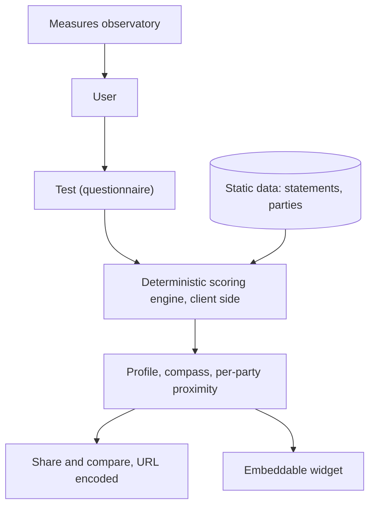
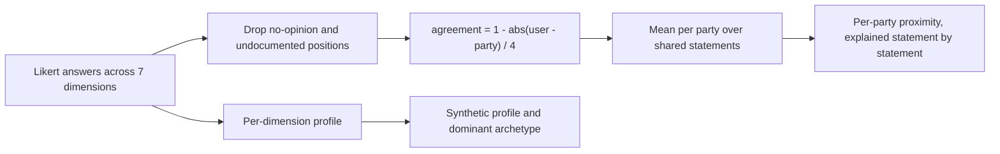
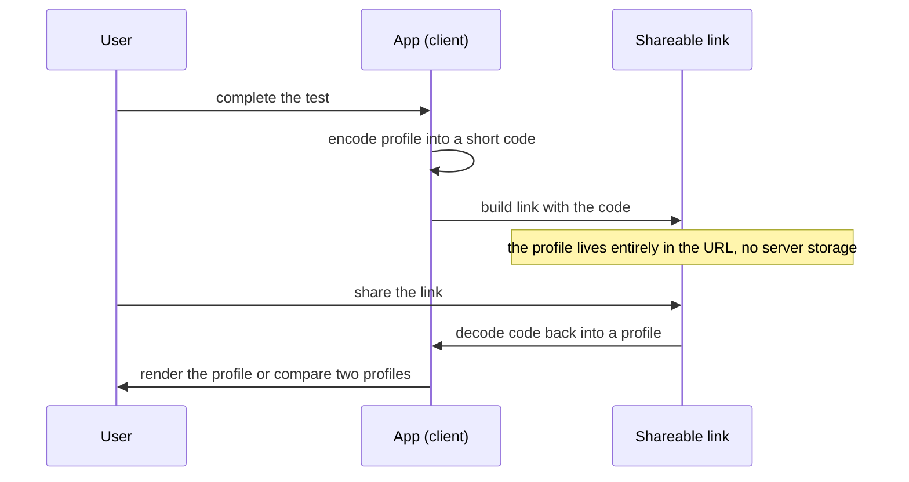
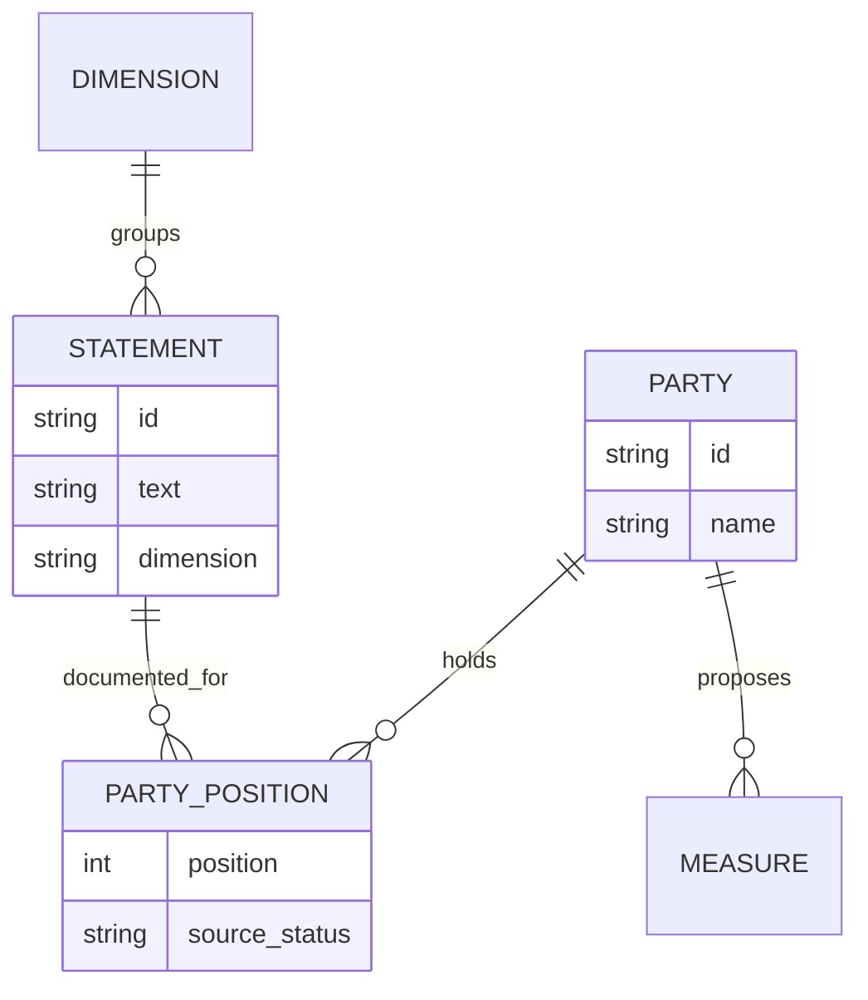

# Le Crible Politique

**A mirror, not a judge.** A French/Belgian political self-assessment tool that
compares your own positions, statement by statement, against the documented
positions of 24 political parties, and puts emblematic campaign measures through
the lens of the law.

The product is in French because its content is French and Belgian political
material (party manifestos, statements, legal analyses). The codebase, comments
and developer documentation are in English; the user-facing copy and the
political data stay in French on purpose.

> Note on naming and licensing: the product is "Le Crible Politique" (the prior
> working name was "Political Reality Check"). The repository ships data,
> methodology and governance under CC BY 4.0 (see [LICENSE](LICENSE)). The
> source code license should be confirmed before any public release: the current
> [LICENSE](LICENSE) file still marks the code as all-rights-reserved, which is
> inconsistent with an open-source publication and needs an explicit decision
> (for example MIT or AGPL) from the rights holder.

## What the app does

The app is a Next.js (App Router) site with four surfaces:

- **The test** (`/test`): 12 express statements give a first profile in about 3
  minutes, refined up to 28 statements. Results are layered: a shareable
  synthetic profile, a 7-dimension compass, and proximity to 24 parties (FR/BE)
  explained statement by statement with a sourcing status. Two opt-in modules:
  moral foundations (Haidt's MFT) and a material impact estimate in euros per
  month (based on published scales). An optional voice-interview mode reads each
  statement aloud.
- **The observatory** (`/crible`): emblematic measures from the public debate
  examined through the lens of the law, in an "established / debated" format,
  never a verdict, with one indexable URL per entry.
- **Sharing** (`/p/[code]`, `/compare`): the profile is encoded into the URL,
  with a dynamic Open Graph image and a duo comparison view. No storage.
- **The widget** (`/embed`): the express test, embeddable by media partners in
  an iframe.

### Core doctrine (reflected in the code)

- **Deterministic and published scoring.** The result is computed by a public
  formula, recomputable by hand. No AI model is called during use. See
  [`lib/scoringEngine.ts`](lib/scoringEngine.ts) and
  [METHODOLOGY.md](METHODOLOGY.md).
- **No account, no server-side storage.** Everything is computed in the browser.
  Answers live in `localStorage` and in the share link the user chooses to copy
  (see [`lib/profileCode.ts`](lib/profileCode.ts)).
- **Sourced positions with visible status.** Each party position carries a
  sourcing status (`verifie`, `a_verifier`, `non_documente`) surfaced in the UI;
  corrections are recorded in [CHANGELOG-DONNEES.md](CHANGELOG-DONNEES.md).
- **External validation.** The internal economic axis is continuously checked
  against the Chapel Hill Expert Survey (CHES 2024) by a test that asserts a
  strong rank correlation.

### How the scoring works

For each statement the user answers on a 5-point Likert scale
(-2 strongly disagree to +2 strongly agree, or "no opinion"):

```
agreement(statement) = 1 - |user_position - party_position| / 4
score(party)         = mean of agreements over the statements where
                       (a) the user took a position and
                       (b) the party position is documented
```

"No opinion" answers and undocumented party positions are excluded from the
computation: they are never counted against the user nor against the party. The
engine is fully deterministic: the same answers always produce the same result.

## Architecture

The whole app is a Next.js front end with a deterministic engine that runs client side. There is no AI at runtime, no account, and no server-side storage of answers.

### System overview



### Scoring pipeline



### Stateless profile sharing



### Data model



## Stack

- **Next.js 16** (App Router) and **React 19**, **TypeScript**.
- **Tailwind CSS v4** for styling.
- **recharts** for the moral-foundations radar, **lucide-react** for icons.
- **Vitest** for the test suite.

> Several dependencies declared in `package.json`
> (`@supabase/supabase-js`, `@ai-sdk/anthropic`, `@ai-sdk/openai`, `ai`,
> `zustand`, `react-hook-form`, `zod`) are not imported anywhere in the current
> source. They are leftovers from the AI-bootstrapped scaffold and the two
> pre-merge prototypes. They are consistent with the "no AI at runtime, no
> server storage" doctrine being enforced by removing those code paths, not by
> using those libraries. They can be removed from `package.json` to slim the
> dependency tree (see Limitations below).

## Running locally

Requirements: Node.js 20+ and npm.

```sh
# 1. Configure environment variables (all optional for local dev)
cp .env.local.example .env.local

# 2. Install dependencies
npm install

# 3. Start the dev server
npm run dev          # http://localhost:3000

# 4. Run the test suite
npm test             # vitest run (integrity, determinism, CHES consistency)

# 5. Production build
npm run build
npm start
```

### Environment variables

The app runs without any external service. All environment variables are
optional and only affect SEO/analytics metadata; there is no database and no
Supabase connection in the current code.

| Variable | Purpose |
| --- | --- |
| `NEXT_PUBLIC_SITE_URL` | Public base URL used for canonical links, sitemap, robots and OG images. Falls back to the production domain. |
| `NEXT_PUBLIC_PLAUSIBLE_DOMAIN` | Cookieless Plausible analytics domain. If unset, the analytics script is not injected. |

Keep `.env.local.example` placeholder-only. Never commit a real `.env.local`:
it is ignored by [`.gitignore`](.gitignore).

## How the data is structured

All the data that determines a result lives in `data/`, in plain TypeScript so
it can be read, diffed and audited:

| File | Contents |
| --- | --- |
| [`data/statements.ts`](data/statements.ts) | 28 statements (12 of them in the express subset), 4 per dimension, with agree/disagree labels. |
| [`data/parties.ts`](data/parties.ts) | The 24 parties (France and Belgium) and their reference manifesto. |
| [`data/partyPositions.ts`](data/partyPositions.ts) | Each party's position on each statement (same Likert scale), with a sourcing status and citation. |
| [`data/archetypeSignatures.ts`](data/archetypeSignatures.ts) | Expected answer patterns per archetype, used to identify a dominant archetype per dimension. |
| [`data/syntheticProfiles.ts`](data/syntheticProfiles.ts) | The shareable "identity" layer: matching rules from dominant archetypes to a named profile. |
| [`data/measures.ts`](data/measures.ts) | Legal-feasibility entries for emblematic measures ("established / debated", with norms and sources). |
| [`data/policies.ts`](data/policies.ts) | Material-impact simulator: euros-per-month estimates per party measure, based on published scales. |
| [`data/ches.ts`](data/ches.ts) | CHES 2024 dataset (external validation) plus normalization to the app scale. |
| [`data/insee.ts`](data/insee.ts) | INSEE income/wealth deciles used by the social-class classifier. |
| [`data/moralFoundations.ts`](data/moralFoundations.ts) | The MFT question set (2 items per foundation). |
| [`data/definitions.ts`](data/definitions.ts), [`data/versions.ts`](data/versions.ts) | Dimension definitions and the central data-version registry shown in the UI. |

The pure logic lives in:

- [`lib/scoringEngine.ts`](lib/scoringEngine.ts): party matching and profile
  computation (the public formula).
- [`lib/profileCode.ts`](lib/profileCode.ts): compact URL encoding/decoding of a
  profile, plus `localStorage` validation.
- [`utils/analysis.ts`](utils/analysis.ts): INSEE social-class classifier and
  moral-foundations interpretation.

Types are in `types/`. The display strings in the data and type files
(dimension labels, archetype names, Likert labels, statement text) are kept in
French on purpose: they are the actual product copy.

## Tests

```sh
npm test
```

The suite (Vitest, five files in `__tests__/`) locks the product's central
promises: data integrity, determinism and external consistency.

- `__tests__/scoringEngine.test.ts`: the 28 statements cover 7 dimensions, every
  party has a position on every statement, the agreement formula holds, "no
  opinion" is never penalized, answering a party's exact positions yields 100%,
  the profile-code roundtrip is lossless, and the economic axis correlates
  strongly with CHES `lrecon` (Spearman rho > 0.7).
- `__tests__/profile.test.ts`: `computeProfile` produces the correct mean
  position per dimension, omits dimensions with no answers, selects exactly one
  dominant archetype per answered dimension, and the low-coverage flag tracks
  the confidence threshold.
- `__tests__/science.test.ts`: CHES normalization and provenance, and the moral
  foundations module.
- `__tests__/policies.test.ts`: the material-impact simulator behaves
  monotonically (low-income workers gain more from redistributive programs,
  high earners from tax cuts, rural profiles from fuel measures) and every
  measure has a source.
- `__tests__/analysis.test.ts`: social-class classification and moral-profile
  interpretation.

Current status: **44 tests passing across 5 files**.

## Limitations and how I would improve this

This project was partly bootstrapped with an AI codegen tool, then merged from
two prototypes. It is honest about what is solid and what still needs hardening.

- **Data freshness and sourcing.** Almost the entire party-position coding is at
  status `a_verifier` (preliminary): it was coded from manifestos and public
  statements and still needs adversarial double-coding by reviewers of different
  sensibilities, plus self-positioning offered to the parties themselves. The
  legal-feasibility entries are at status `preliminaire`, pending review by
  named external legal experts. The CHES anchor is 2024; manifestos drift
  between elections. Next step: wire each position to a dated, linked citation
  and surface the coverage ratio prominently.
- **Test coverage.** The suite is meaningful but narrow: it locks the scoring
  invariants and data integrity (the highest-value properties) but there are no
  component or end-to-end tests for the survey flow, the share/compare URLs, or
  the embed widget. Next step: add React Testing Library coverage for the
  results view and the profile-code edge cases in the UI, plus a Playwright
  smoke test of the full `/test` flow.
- **Dependency hygiene.** Several dependencies are declared but unused
  (`@supabase/supabase-js`, the AI SDK packages, `zustand`, `react-hook-form`,
  `zod`), inflating `node_modules` and the supply-chain surface. They are
  leftovers from the bootstrap and the merge. Next step: remove them from
  `package.json` and regenerate the lockfile, then add a `depcheck`/`knip` step
  in CI to keep the tree honest. They were intentionally left in place here to
  avoid shipping an inconsistent lockfile without a reinstall.
- **Accessibility.** Icons are decorative (`aria-hidden`) and the Likert scale
  uses real buttons rather than a slider, which helps, but there is no audited
  keyboard path through the whole survey, no focus-management review, and the
  voice mode needs explicit screen-reader testing. Next step: an a11y pass with
  axe plus manual keyboard and screen-reader runs.
- **AI-bootstrapped parts that need hardening.** The data-heavy files were
  scaffolded with AI assistance; the values must be human-verified against
  primary sources before any public claim of accuracy (this is exactly what the
  `a_verifier` status and [GOVERNANCE.md](GOVERNANCE.md) encode). The
  AI-usage charter and prompts live in `transparence-ia/`.
- **Code license.** As noted above, the [LICENSE](LICENSE) still marks the code
  as proprietary. That must be reconciled with the intent to open-source before
  publishing.
- **Pre-launch checklist (human).** Fill the publisher-identity placeholders on
  the `/a-propos` page (legally required in France), connect the production
  domains, and document the cookieless analytics choice on the privacy page.

## Transparency model

Everything that determines a result is public and reproducible by hand:
statements, party positions with sources and statuses, archetype signatures, the
formula ([METHODOLOGY.md](METHODOLOGY.md) and `/methodology`), governance
([GOVERNANCE.md](GOVERNANCE.md)), the data change log
([CHANGELOG-DONNEES.md](CHANGELOG-DONNEES.md)), and the AI-usage record
(`transparence-ia/`).

## License

Data, methodology, governance and AI-transparency material: CC BY 4.0. Source
code: see [LICENSE](LICENSE) (to be confirmed before public release). Required
attribution: "Le Crible Politique".
