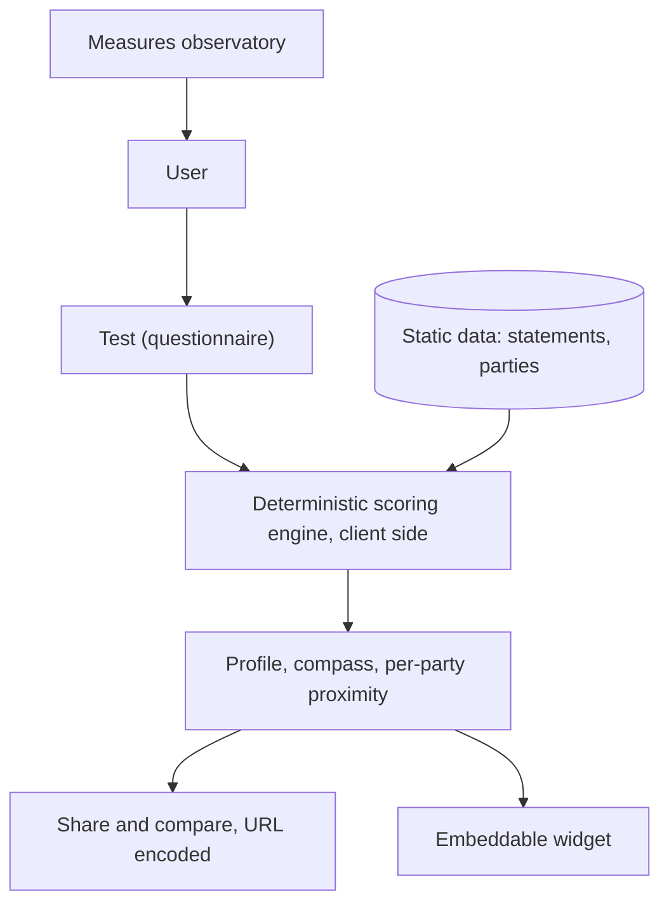
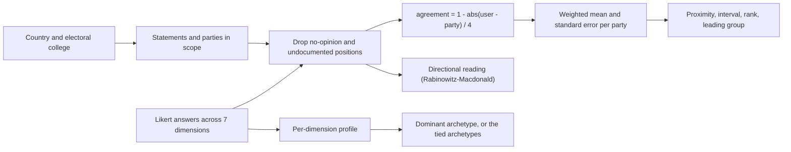
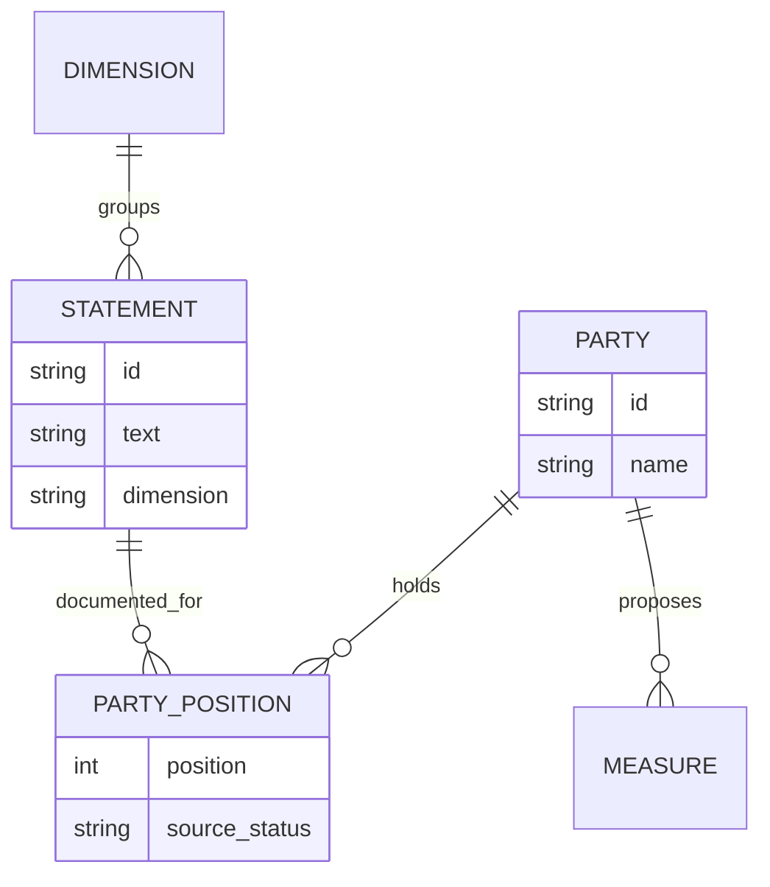

<p align="center">
  
</p>

<p align="center">
  <a href="LICENSE"></a>
  <a href="data/LICENSE"></a>
  
  
  
</p>

# Le Crible Politique

**A mirror, not a judge.** A French/Belgian political self-assessment tool that
compares your own positions, statement by statement, against the documented
positions of 24 political parties, and puts emblematic campaign measures through
the lens of the law.

The product is in French because its content is French and Belgian political
material (party manifestos, statements, legal analyses). The codebase, comments
and developer documentation are in English; the user-facing copy and the
political data stay in French on purpose.

> Naming: the product is "Le Crible Politique" (the prior working name was
> "Political Reality Check", which is why the logo reads `PC`). Licensing is
> split: the source code is under the MIT License and the political data under
> CC BY 4.0. See [License](#license) for details.

## What the app does

The app is a Next.js (App Router) site with four surfaces:

- **The test** (`/test`): the respondent picks a country first (France or
  Belgium, then a Belgian electoral college), because that decides which
  statements are asked and which ballot the parties are actually on. 14 express
  statements give a first profile in about 3 minutes, refined up to 30. Results
  are layered: a shareable synthetic profile, a 7-dimension compass, and
  proximity to the parties of that ballot, each with a confidence interval, a
  rank and a statement-by-statement explanation carrying a sourcing status. Two
  opt-in modules: moral foundations (Haidt's MFT) and a material impact estimate
  in euros per month (based on published scales). An optional voice-interview
  mode reads each statement aloud. When two currents of a dimension end tied,
  the test asks up to two extra statements chosen to separate them, rather than
  picking whichever the data file happens to declare first.
- **The observatory** (`/crible`): emblematic measures from the public debate
  examined through the lens of the law, in an "established / debated" format,
  never a verdict, with one indexable URL per entry.
- **Sharing** (`/p/[code]`, `/compare`): the profile is encoded into the URL,
  with a dynamic Open Graph image and a duo comparison view. No storage.
- **The widget** (`/embed`): the express test, embeddable by media partners in
  an iframe.

### Core doctrine (reflected in the code)

- **Deterministic and published scoring.** The result is computed by a public
  formula, recomputable by hand. No AI model is called during use. See
  [`lib/scoringEngine.ts`](lib/scoringEngine.ts) and
  [METHODOLOGY.md](METHODOLOGY.md).
- **No account, no server-side storage.** Everything is computed in the browser.
  Answers live in `localStorage` and in the share link the user chooses to copy
  (see [`lib/profileCode.ts`](lib/profileCode.ts)).
- **Sourced positions with visible status.** Each party position carries a
  sourcing status (`verifie`, `a_verifier`, `non_documente`) surfaced in the UI;
  corrections are recorded in [CHANGELOG-DONNEES.md](CHANGELOG-DONNEES.md).
- **External validation.** The internal economic axis is continuously checked
  against the Chapel Hill Expert Survey (CHES 2024) by a test that asserts a
  strong rank correlation. A second test enforces measurement invariance: a
  statement may only be asked in both countries if it points the same way on
  every CHES axis in both, which is what forced the old decentralization
  statement to be split into a French and a Belgian version.
- **Uncertainty is published, not hidden.** Every proximity carries a 90%
  confidence interval, parties whose intervals overlap the leader's are named as
  a leading group rather than arbitrated, and the ranking is offered under two
  spatial models (proximity and directional) whose biases run in opposite
  directions.

### How the scoring works

For each statement the user answers on a 5-point Likert scale
(-2 strongly disagree to +2 strongly agree, or "no opinion"):

```
agreement(statement) = 1 - |user_position - party_position| / 4
score(party)         = weighted mean of agreements over the statements where
                       (a) the user took a position and
                       (b) the party position is documented
standard error       = weighted standard deviation / sqrt(comparisons)
interval             = score +/- 1.645 * standard error        (90%)
directional(party)   = 50 + 50 * sum(user_position * party_position)
                            / (4 * comparisons)
```

"No opinion" answers and undocumented party positions are excluded from the
computation: they are never counted against the user nor against the party.
Salience weights default to 1, so the weighted mean reduces to the plain mean
and the formula above stays recomputable by hand. Parties whose interval
overlaps the leader's share the lead; parties with the same score share a rank.
The engine is fully deterministic: the same answers always produce the same
result. The full rationale, with the measurements that justify each addition,
is in [METHODOLOGY.md](METHODOLOGY.md).

## Architecture

The whole app is a Next.js front end with a deterministic engine that runs client side. There is no AI at runtime, no account, and no server-side storage of answers.

### System overview


```mermaid
flowchart TB
    User[User] --> Test["Test (questionnaire)"]
    Test --> Engine["Deterministic scoring engine, client side"]
    Data[("Static data: statements, parties")] --> Engine
    Engine --> Result["Profile, compass, per-party proximity"]
    Result --> Share["Share and compare, URL encoded"]
    Result --> Embed["Embeddable widget"]
    Observatory["Measures observatory"] --> User
```

### Scoring pipeline


```mermaid
flowchart LR
    Country["Country and electoral college"] --> Scope["Statements and parties in scope"]
    Scope --> Filter
    Answers["Likert answers across 7 dimensions"] --> Filter["Drop no-opinion and undocumented positions"]
    Filter --> Agree["agreement = 1 - abs(user - party) / 4"]
    Agree --> Mean["Weighted mean and standard error per party"]
    Mean --> Proximity["Proximity, interval, rank, leading group"]
    Filter --> Directional["Directional reading (Rabinowitz-Macdonald)"]
    Answers --> Compass["Per-dimension profile"]
    Compass --> Archetype["Dominant archetype, or the tied archetypes"]
```

### Stateless profile sharing

Nothing is stored, so a shared profile has to travel in the link. Where in the
link is the whole design, because a set of answers to 30 political statements
is special-category data under GDPR article 9 and a URL is not one thing:

| Part of the URL | Transmitted to the server | What it carries |
| --- | --- | --- |
| path (`/p/26111404`) | yes, and to every link-preview crawler | the badge: seven dominant currents and the profile they imply |
| fragment (`#p=2fdcb…`) | never | the country and the answers |

A badge code is one character per dimension, so it addresses at most 37^7
badges against 6^30 answer sets: it is not a lossy encoding of the answers, it
cannot be an encoding of them at all. That is what lets the server render the
page and generate the Open Graph card without ever receiving the answers. The
recipient's browser reads the fragment and offers to compare profiles;
everything after that is client-side.

```mermaid
sequenceDiagram
    participant U as User
    participant App as App (client)
    participant Link as Shareable link
    participant Server as Server and crawlers
    U->>App: complete the test
    App->>App: encode a badge code and an answer code
    App->>Link: /p/{badge}#p={answers}
    U->>Link: share the link
    Link->>Server: request carries the path only
    Server->>App: page and OG card, rendered from the badge
    Link->>App: the browser reads the fragment
    App->>U: profile, and the option to compare
```

An answer code is versioned: `2` + a country character + one character per
answer + two check characters. They exist because both corpora hold 30
statements, so before them a single mangled character (`f` for France into `b`
for Belgium) turned a French link into a valid Belgian profile, and the
recipient saw a plausible wrong profile attributed to the person who had shared
it. The first check character is the plain sum modulo 36, which catches every
single-character substitution. The second weighs each character by its
position, which catches every swap of two adjacent answers. A swap between two
distant answers survives only when the distance times the character difference
is a multiple of 36, and that residue is the stated limit.

Version 1 codes stay readable. Naming no country, they lead to the country
picker with the answers kept, rather than assuming one. Links minted before
badge codes existed carried the answers in the path, and `identityFromShareCode`
still reads them, so those links keep resolving to the same page. Links that
carried a code in a query string (`/compare?a=`, `/test?p=`) are honoured too,
and rewritten in place to the fragment form.

### Data model


```mermaid
erDiagram
    DIMENSION ||--o{ STATEMENT : groups
    STATEMENT ||--o{ PARTY_POSITION : documented_for
    PARTY ||--o{ PARTY_POSITION : holds
    PARTY ||--o{ MEASURE : proposes
    STATEMENT {
        string id
        string text
        string dimension
    }
    PARTY_POSITION {
        int position
        string source_status
    }
    PARTY {
        string id
        string name
    }
```

## Stack

- **Next.js 16** (App Router) and **React 19**, **TypeScript**.
- **Tailwind CSS v4** for styling.
- **recharts** for the moral-foundations radar, **lucide-react** for icons.
- **Vitest** for the test suite.

> The dependency tree is deliberately small: no state library, no form
> library, no validation library, no server SDK. Everything the product does
> at runtime is a pure function over data files, so there was nothing for them
> to do. `npm audit` runs as a blocking CI job, and the one resolution pinned
> by hand is explained in [SECURITY.md](SECURITY.md).

## Running locally

Requirements: Node.js 22+ and npm. CI runs the same version.

```sh
# 1. Configure environment variables (all optional for local dev)
cp .env.local.example .env.local

# 2. Install dependencies
npm install

# 3. Start the dev server
npm run dev          # http://localhost:3000

# 4. Run the test suite
npm test             # vitest run (integrity, determinism, CHES consistency)

# 5. Production build
npm run build
npm start
```

### Environment variables

The app runs without any external service. All environment variables are
optional and only affect SEO/analytics metadata; there is no database and no
Supabase connection in the current code.

| Variable | Purpose |
| --- | --- |
| `NEXT_PUBLIC_SITE_URL` | Public base URL used for canonical links, sitemap, robots and OG images. Falls back to the production domain. |
| `NEXT_PUBLIC_PLAUSIBLE_DOMAIN` | Cookieless Plausible analytics domain. If unset, the analytics script is not injected. |

Keep `.env.local.example` placeholder-only. Never commit a real `.env.local`:
it is ignored by [`.gitignore`](.gitignore).

## How the data is structured

All the data that determines a result lives in `data/`, in plain TypeScript so
it can be read, diffed and audited:

| File | Contents |
| --- | --- |
| [`data/statements.ts`](data/statements.ts) | 30 statements common to both countries plus 3 specific to each, so 33 per respondent: 4 per dimension, except geopolitics which carries 7 (Ukraine, Russia and the Middle East were measured missing). Each country has its own 14-statement express subset. |
| [`data/parties.ts`](data/parties.ts) | The 24 parties (12 French, 12 Belgian) with their reference manifesto, their country and, for the Belgian ones, the electoral colleges they run in. |
| [`data/partyPositions.ts`](data/partyPositions.ts) | Each party's position on each statement (same Likert scale), with a sourcing status and citation. |
| [`data/archetypeSignatures.ts`](data/archetypeSignatures.ts) | Expected answer patterns per archetype, used to identify a dominant archetype per dimension. Every archetype of a dimension is scored on exactly the same statements, so no current wins by having a shorter signature. |
| [`data/syntheticProfiles.ts`](data/syntheticProfiles.ts) | The shareable "identity" layer: matching rules from dominant archetypes to a named profile. |
| [`data/measures.ts`](data/measures.ts) | Legal-feasibility entries for emblematic measures ("established / debated", with norms and sources). |
| [`data/policies.ts`](data/policies.ts) | Material-impact simulator: euros-per-month estimates per party measure, based on published scales. |
| [`data/ches.ts`](data/ches.ts) | CHES 2024 dataset (external validation) plus normalization to the app scale. |
| [`data/insee.ts`](data/insee.ts) | INSEE income/wealth deciles used by the social-class classifier. |
| [`data/moralFoundations.ts`](data/moralFoundations.ts) | The MFT question set (2 items per foundation). |
| [`data/definitions.ts`](data/definitions.ts), [`data/versions.ts`](data/versions.ts) | Dimension definitions and the central data-version registry shown in the UI. |

The pure logic lives in:

- [`lib/scoringEngine.ts`](lib/scoringEngine.ts): party matching and profile
  computation (the public formula).
- [`lib/profileCode.ts`](lib/profileCode.ts): compact URL encoding/decoding of a
  profile, plus `localStorage` validation.
- [`lib/electoralScope.ts`](lib/electoralScope.ts): which statements are asked
  and which parties are on the ballot, given a country and a Belgian college.
- [`lib/measurementInvariance.ts`](lib/measurementInvariance.ts): the rank
  correlation and the invariance rule the CHES tests are written against.
- [`lib/resultsReading.ts`](lib/resultsReading.ts): the proximity/directional
  switch and the ranking that belongs to each reading.
- [`lib/duoComparison.ts`](lib/duoComparison.ts): the two-profile comparison,
  including how many statements the two respondents actually share.
- [`lib/adaptiveClarification.ts`](lib/adaptiveClarification.ts): which extra
  statement to ask when a dimension ends with two currents tied.
- [`utils/analysis.ts`](utils/analysis.ts): INSEE social-class classifier and
  moral-foundations interpretation.

Types are in `types/`. The display strings in the data and type files
(dimension labels, archetype names, Likert labels, statement text) are kept in
French on purpose: they are the actual product copy.

## Tests

```sh
npm test
```

The suite (Vitest, twenty-two files in `__tests__/`) locks the product's central
promises: data integrity, determinism, external consistency, the honesty of what
the result claims, and the privacy properties of the share links.

- `__tests__/scoringEngine.test.ts`: the 33 statements of each country cover 7
  dimensions, every party has a position on every statement of its country, the
  agreement formula holds, "no opinion" is never penalized, answering a party's
  exact positions yields 100%, the profile-code roundtrip is lossless, and the
  economic axis correlates strongly with CHES `lrecon` (Spearman rho > 0.7).
- `__tests__/electoralScope.test.ts`: which statements and which parties a
  country and a college select, that a French respondent is never shown a
  Belgian statement or a party they cannot vote for, that every Belgian party
  belongs to at least one college, and that a corrupted country or college is
  rejected at the boundary rather than defaulted.
- `__tests__/measurementInvariance.test.ts`: the Spearman implementation
  (including ties and a constant vector), and the invariance rule itself, which
  is asserted against the real corpus: no common statement may point in
  substantially opposite directions on any CHES axis between the two countries.
- `__tests__/archetypes.test.ts`: every archetype of a dimension is scored on
  exactly the same statements, no two archetypes share a signature, no party
  vector is a duplicate of another, and every one of the 79 archetypes is
  reachable by some set of answers on the full test.
- `__tests__/scoringUncertainty.test.ts`: the interval narrows as comparisons
  accumulate, the leading group contains the leader and every party overlapping
  it, equal scores share a rank (1, 2, 2, 4), the directional reading orders
  differently from the proximity one, salience weights change nothing at equal
  weights and are rejected when non-positive or non-finite.
- `__tests__/profileCode.test.ts`: the version-2 round trip carries the country,
  every single-character substitution and every adjacent swap are rejected by
  the two check characters, a version-1 code still decodes and reports no
  country, and every malformed shape is refused.
- `__tests__/adaptiveClarification.test.ts`: the tie-break proposes only
  unanswered statements of a tied dimension over which the tied signatures
  actually disagree, respects its two-question budget, and makes all 79
  archetypes uniquely reachable in both countries.
- `__tests__/clarifySurvey.test.tsx`: the same stage in jsdom. That it asks,
  records, goes back, completes exactly once, and never names the tied currents
  before the answer, which would steer the measurement.
- `__tests__/sourcing.test.ts`: no position claims `verifie` without a dated and
  linked citation, no party is documented outside its own country, and no two
  parties sharing a ballot hold rigorously identical vectors.
- `__tests__/profile.test.ts`: `computeProfile` produces the correct mean
  position per dimension, omits dimensions with no answers, selects exactly one
  dominant archetype per answered dimension, and the low-coverage flag tracks
  the confidence threshold.
- `__tests__/science.test.ts`: CHES normalization and provenance, and the moral
  foundations module.
- `__tests__/policies.test.ts`: the material-impact simulator behaves
  monotonically (low-income workers gain more from redistributive programs,
  high earners from tax cuts, rural profiles from fuel measures) and every
  measure has a source.
- `__tests__/analysis.test.ts`: social-class classification and moral-profile
  interpretation.
- `__tests__/shareLink.test.ts`: what a share URL puts where, and that a legacy
  query-string code is honoured and moved into the fragment without disturbing
  the rest of the URL.
- `__tests__/badgeCode.test.ts`: the badge round trip, the rejection of every
  malformed code, and two golden fixtures that fail if `data/badgeAlphabet.ts`
  is ever reordered, which would silently change what an already shared link
  means.
- `__tests__/serviceWorker.test.ts`: what the offline cache is allowed to hold,
  in particular that a shared profile and a comparison are never written to it.
- `__tests__/localData.test.ts`: that "effacer mes données locales" reaches
  local storage, session storage, the caches and the service worker, and keeps
  going when one of them refuses.
- `__tests__/useShareCodes.test.tsx`: the browser half of the same path, in
  jsdom. That the hook reports nothing until it has read the location rather
  than reporting "no profile", that it rewrites a legacy query URL in place,
  and that it keeps up when the fragment changes under the page. Plus the
  erase button, clicked for real.
- `__tests__/resultsReading.test.ts`: that switching to the directional reading
  re-ranks the parties instead of relabelling the proximity order, which is the
  regression it was written for.
- `__tests__/duoComparison.test.ts`: the two-profile comparison, in particular
  that two respondents from different countries are compared only on the
  statements they actually share.
- `__tests__/tapTargets.test.tsx`: that the survey controls a thumb has to hit
  are at least 44px tall, rendered in jsdom.

Current status: **250 tests passing across 22 files**. They run in CI on every
push and pull request, alongside ESLint, `tsc --noEmit`, the production build,
`npm audit` and the privacy check below. Both jobs are required to merge into
`main`.

### The build budget

```sh
npm run build && npm run check:build
```

[`scripts/build-budget.mjs`](scripts/build-budget.mjs) asserts that every route
is still built, and still built the way it is meant to be: static pages stay
prerendered, `/p/[code]` stays dynamic because it has to read its own path, and
a new route has to be declared. It also measures the JavaScript a first visit
downloads, gzipped, against a stated ceiling. It runs in CI, and it catches
both kinds of regression: adding `export const dynamic = 'force-dynamic'` to a
page fails it by name, and so does the budget being exceeded.

### The privacy check

```sh
npm run check:privacy
```

The property this application exists to hold, that a set of answers never
reaches a server, is not visible to a unit test: it is a property of what a
browser transmits, not of what a function returns. So
[`scripts/privacy-check.mjs`](scripts/privacy-check.mjs) starts the production
build behind a proxy that records the exact request line the server receives,
drives a real headless browser to five share links (a French profile, a Belgian
one, a badge page, a comparison and a version-1 legacy link), and fails if any
answer code appears in any of them. It also asserts each page rendered, because a
check that passes because nothing loaded is worse than no check, and asserts
who is allowed to put each page inside a frame.

It runs in CI, and it catches a real regression: adding a single
`fetch('/?leaked=' + code)` to the hook fails all three cases and prints the
offending request line.

## Limitations and how I would improve this

This project was partly bootstrapped with an AI codegen tool, then merged from
two prototypes. It is honest about what is solid and what still needs hardening.

- **Data freshness and sourcing.** Almost the entire party-position coding is at
  status `a_verifier` (preliminary): it was coded from manifestos and public
  statements and still needs adversarial double-coding by reviewers of different
  sensibilities, plus self-positioning offered to the parties themselves. The
  legal-feasibility entries are at status `preliminaire`, pending review by
  named external legal experts. The CHES anchor is 2024; manifestos drift
  between elections. Next step: wire each position to a dated, linked citation
  and surface the coverage ratio prominently.
- **Test coverage.** The suite locks the scoring invariants, the data
  integrity, the uncertainty arithmetic and the privacy properties of the share
  links, all as pure functions, plus the hook, the erase button and the survey
  tap targets in jsdom. What it still does not cover is the larger components
  rendered end to end: there is no full rendering test of the survey flow, the
  results view or the embed widget. Those paths were verified in a real browser
  at a real 375px viewport, and the share-link behaviour is measured in CI by
  `npm run check:privacy`, which records the request line the server receives.
  Next step: React Testing Library coverage of the results view and the survey
  flow.
- **Ambivalent respondents still end tied.** The 14 express statements alone
  could never single out 35 of the 79 archetypes in France and 52 in Belgium
  (exhaustive enumeration). The adaptive tie-break now asks up to two extra
  statements per tied dimension, which makes all 79 reachable for a respondent
  whose answers are consistent. Someone genuinely ambivalent still ends tied,
  and the tie is displayed rather than arbitrated. Next step: study whether the
  clarifying statements should also feed the party comparison, which today they
  do without being chosen for it.
- **The new country-specific positions are unsourced.** The six statements added
  to scope the test by country carry 72 party positions coded from manifestos
  and public statements, all at status `a_verifier`. They need the same
  adversarial double-coding as the rest before any claim of accuracy. One of
  them has already been caught and corrected this way: a differentiation
  invented between Ecolo and Groen was reverted once the sources showed the two
  parties published a single common institutional vision in January 2024.
- **Parties with identical positions are ordered by the data file.** Ecolo and
  Groen hold rigorously identical coded positions, correctly so. They receive
  the same score and the same displayed rank, but inside that tie one is always
  listed above the other. Next step: mark an exact tie as such in the list,
  rather than letting the reading order imply a winner.
- **Accessibility.** Icons are decorative (`aria-hidden`) and the Likert scale
  uses real buttons rather than a slider, which helps, but there is no audited
  keyboard path through the whole survey, no focus-management review, and the
  voice mode needs explicit screen-reader testing. Next step: an a11y pass with
  axe plus manual keyboard and screen-reader runs.
- **AI-bootstrapped parts that need hardening.** The data-heavy files were
  scaffolded with AI assistance; the values must be human-verified against
  primary sources before any public claim of accuracy (this is exactly what the
  `a_verifier` status and [GOVERNANCE.md](GOVERNANCE.md) encode). The
  AI-usage charter and prompts live in `transparence-ia/`.
- **Pre-launch checklist (human).** Fill the publisher-identity placeholders on
  the `/a-propos` page and name a contact for GDPR requests on `/legal`, both
  legally required for a site published in France, and connect the production
  domains.

## Transparency model

Everything that determines a result is public and reproducible by hand:
statements, party positions with sources and statuses, archetype signatures, the
formula ([METHODOLOGY.md](METHODOLOGY.md) and `/methodology`), governance
([GOVERNANCE.md](GOVERNANCE.md)), the data change log
([CHANGELOG-DONNEES.md](CHANGELOG-DONNEES.md)), and the AI-usage record
(`transparence-ia/`).

## Contributing

Contributions are welcome, under one rule above all: **political neutrality**.
This is a mirror, not a megaphone. The most valuable help here is usually not
code, it is sourcing. Read [GOVERNANCE.md](GOVERNANCE.md) first; it defines the
non-negotiable commitments (independence, transparency, neutrality) that every
contribution must respect.

**Data corrections and sourcing (highest priority).** Most party positions are at
status `a_verifier`: coded from manifestos and statements, and waiting for
adversarial double-coding by reviewers of different sensibilities. If you can
document or correct a position with a dated, linked primary source:

1. open an issue with the statement, the party, the proposed position and the
   source, or
2. send a PR editing [`data/partyPositions.ts`](data/partyPositions.ts) and
   logging the change in [CHANGELOG-DONNEES.md](CHANGELOG-DONNEES.md). Only set
   `source_status: "verifie"` when you attach a real citation.

**Code contributions.**

- Keep the engine deterministic: no AI call at runtime, no server-side storage of
  answers. Anything that changes a result must be a published, hand-recomputable
  formula ([METHODOLOGY.md](METHODOLOGY.md)).
- `npm test` must stay green (250 tests lock determinism, data integrity, the
  CHES external-consistency check, measurement invariance across the two
  countries, and what a share link is allowed to put in a URL). Ship a test with
  any behaviour change.
- Never put an answer code anywhere the server sees it: not in a path, not in a
  query string. The fragment is the only place. See
  [Stateless profile sharing](#stateless-profile-sharing); `npm run
  check:privacy` enforces it.
- `data/badgeAlphabet.ts` is append only. Reordering it changes what every
  already shared link means. `LEGACY_V1_STATEMENT_IDS` in `lib/profileCode.ts`
  is frozen for the same reason: it is the corpus the already-shared version-1
  links were minted against, not the current one.
- Match the existing style. User-facing copy and political data stay in French;
  code and comments are in English.

**Good first issues.** The items under [Limitations](#limitations-and-how-i-would-improve-this)
are deliberately scoped entry points: an accessibility pass on the survey flow,
component tests for the results view, and a Playwright smoke test of `/test`
that asserts no request carries an answer code.

## License

This repository uses a split license.

- **Source code** is under the **MIT License** (see [LICENSE](LICENSE)). You may reuse it freely as long as you keep the copyright notice, which credits Olivier Dehareng.
- **Data** in [`data/`](data) (party positions, statements and measures) is under **CC BY 4.0** (see [data/LICENSE](data/LICENSE)). If you reuse the data you must give appropriate credit to Olivier Dehareng and link back to this repository.

Suggested attribution. Le Crible Politique by Olivier Dehareng, https://github.com/DeharengOlivier/crible-politique
