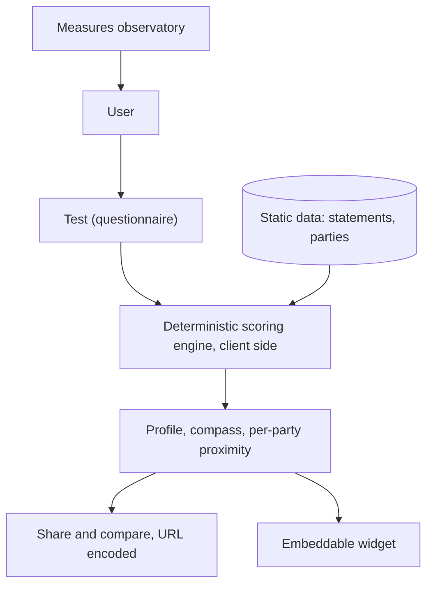
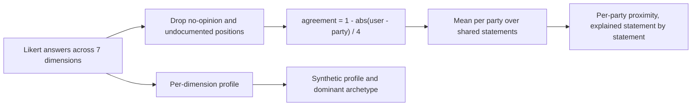
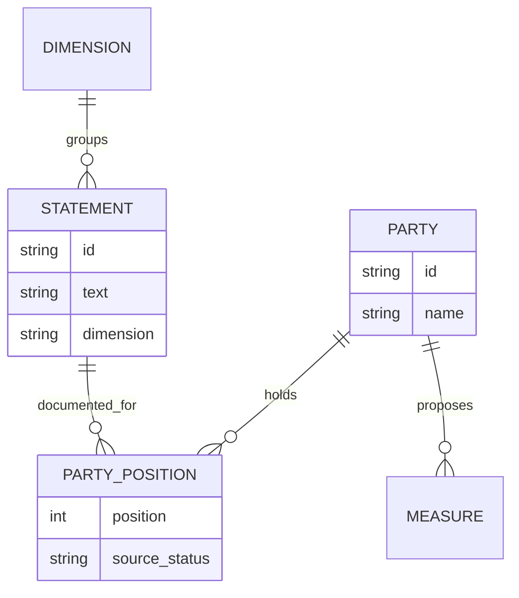

<p align="center">
  
</p>

<p align="center">
  <a href="LICENSE"></a>
  <a href="data/LICENSE"></a>
  
  
  
</p>

# Le Crible Politique

**A mirror, not a judge.** A French/Belgian political self-assessment tool that
compares your own positions, statement by statement, against the documented
positions of 24 political parties, and puts emblematic campaign measures through
the lens of the law.

The product is in French because its content is French and Belgian political
material (party manifestos, statements, legal analyses). The codebase, comments
and developer documentation are in English; the user-facing copy and the
political data stay in French on purpose.

> Naming: the product is "Le Crible Politique" (the prior working name was
> "Political Reality Check", which is why the logo reads `PC`). Licensing is
> split: the source code is under the MIT License and the political data under
> CC BY 4.0. See [License](#license) for details.

## What the app does

The app is a Next.js (App Router) site with four surfaces:

- **The test** (`/test`): 12 express statements give a first profile in about 3
  minutes, refined up to 28 statements. Results are layered: a shareable
  synthetic profile, a 7-dimension compass, and proximity to 24 parties (FR/BE)
  explained statement by statement with a sourcing status. Two opt-in modules:
  moral foundations (Haidt's MFT) and a material impact estimate in euros per
  month (based on published scales). An optional voice-interview mode reads each
  statement aloud.
- **The observatory** (`/crible`): emblematic measures from the public debate
  examined through the lens of the law, in an "established / debated" format,
  never a verdict, with one indexable URL per entry.
- **Sharing** (`/p/[code]`, `/compare`): the profile is encoded into the URL,
  with a dynamic Open Graph image and a duo comparison view. No storage.
- **The widget** (`/embed`): the express test, embeddable by media partners in
  an iframe.

### Core doctrine (reflected in the code)

- **Deterministic and published scoring.** The result is computed by a public
  formula, recomputable by hand. No AI model is called during use. See
  [`lib/scoringEngine.ts`](lib/scoringEngine.ts) and
  [METHODOLOGY.md](METHODOLOGY.md).
- **No account, no server-side storage.** Everything is computed in the browser.
  Answers live in `localStorage` and in the share link the user chooses to copy
  (see [`lib/profileCode.ts`](lib/profileCode.ts)).
- **Sourced positions with visible status.** Each party position carries a
  sourcing status (`verifie`, `a_verifier`, `non_documente`) surfaced in the UI;
  corrections are recorded in [CHANGELOG-DONNEES.md](CHANGELOG-DONNEES.md).
- **External validation.** The internal economic axis is continuously checked
  against the Chapel Hill Expert Survey (CHES 2024) by a test that asserts a
  strong rank correlation.

### How the scoring works

For each statement the user answers on a 5-point Likert scale
(-2 strongly disagree to +2 strongly agree, or "no opinion"):

```
agreement(statement) = 1 - |user_position - party_position| / 4
score(party)         = mean of agreements over the statements where
                       (a) the user took a position and
                       (b) the party position is documented
```

"No opinion" answers and undocumented party positions are excluded from the
computation: they are never counted against the user nor against the party. The
engine is fully deterministic: the same answers always produce the same result.

## Architecture

The whole app is a Next.js front end with a deterministic engine that runs client side. There is no AI at runtime, no account, and no server-side storage of answers.

### System overview


```mermaid
flowchart TB
    User[User] --> Test["Test (questionnaire)"]
    Test --> Engine["Deterministic scoring engine, client side"]
    Data[("Static data: statements, parties")] --> Engine
    Engine --> Result["Profile, compass, per-party proximity"]
    Result --> Share["Share and compare, URL encoded"]
    Result --> Embed["Embeddable widget"]
    Observatory["Measures observatory"] --> User
```

### Scoring pipeline


```mermaid
flowchart LR
    Answers["Likert answers across 7 dimensions"] --> Filter["Drop no-opinion and undocumented positions"]
    Filter --> Agree["agreement = 1 - abs(user - party) / 4"]
    Agree --> Mean["Mean per party over shared statements"]
    Mean --> Proximity["Per-party proximity, explained statement by statement"]
    Answers --> Compass["Per-dimension profile"]
    Compass --> Archetype["Synthetic profile and dominant archetype"]
```

### Stateless profile sharing

Nothing is stored, so a shared profile has to travel in the link. Where in the
link is the whole design, because a set of answers to 28 political statements
is special-category data under GDPR article 9 and a URL is not one thing:

| Part of the URL | Transmitted to the server | What it carries |
| --- | --- | --- |
| path (`/p/2046354a`) | yes, and to every link-preview crawler | the badge: seven dominant currents and the profile they imply |
| fragment (`#p=1eeba…`) | never | the answers |

A badge code is one character per dimension, so it addresses at most 37^7
badges against 6^28 answer sets: it is not a lossy encoding of the answers, it
cannot be an encoding of them at all. That is what lets the server render the
page and generate the Open Graph card without ever receiving the answers. The
recipient's browser reads the fragment and offers to compare profiles;
everything after that is client-side.

```mermaid
sequenceDiagram
    participant U as User
    participant App as App (client)
    participant Link as Shareable link
    participant Server as Server and crawlers
    U->>App: complete the test
    App->>App: encode a badge code and an answer code
    App->>Link: /p/{badge}#p={answers}
    U->>Link: share the link
    Link->>Server: request carries the path only
    Server->>App: page and OG card, rendered from the badge
    Link->>App: the browser reads the fragment
    App->>U: profile, and the option to compare
```

Links minted before badge codes existed carried the answers in the path, and
`identityFromShareCode` still reads them, so those links keep resolving to the
same page. Links that carried a code in a query string (`/compare?a=`,
`/test?p=`) are honoured too, and rewritten in place to the fragment form.

### Data model


```mermaid
erDiagram
    DIMENSION ||--o{ STATEMENT : groups
    STATEMENT ||--o{ PARTY_POSITION : documented_for
    PARTY ||--o{ PARTY_POSITION : holds
    PARTY ||--o{ MEASURE : proposes
    STATEMENT {
        string id
        string text
        string dimension
    }
    PARTY_POSITION {
        int position
        string source_status
    }
    PARTY {
        string id
        string name
    }
```

## Stack

- **Next.js 16** (App Router) and **React 19**, **TypeScript**.
- **Tailwind CSS v4** for styling.
- **recharts** for the moral-foundations radar, **lucide-react** for icons.
- **Vitest** for the test suite.

> The dependency tree is deliberately small: no state library, no form
> library, no validation library, no server SDK. Everything the product does
> at runtime is a pure function over data files, so there was nothing for them
> to do. `npm audit` runs as a blocking CI job, and the one resolution pinned
> by hand is explained in [SECURITY.md](SECURITY.md).

## Running locally

Requirements: Node.js 22+ and npm. CI runs the same version.

```sh
# 1. Configure environment variables (all optional for local dev)
cp .env.local.example .env.local

# 2. Install dependencies
npm install

# 3. Start the dev server
npm run dev          # http://localhost:3000

# 4. Run the test suite
npm test             # vitest run (integrity, determinism, CHES consistency)

# 5. Production build
npm run build
npm start
```

### Environment variables

The app runs without any external service. All environment variables are
optional and only affect SEO/analytics metadata; there is no database and no
Supabase connection in the current code.

| Variable | Purpose |
| --- | --- |
| `NEXT_PUBLIC_SITE_URL` | Public base URL used for canonical links, sitemap, robots and OG images. Falls back to the production domain. |
| `NEXT_PUBLIC_PLAUSIBLE_DOMAIN` | Cookieless Plausible analytics domain. If unset, the analytics script is not injected. |

Keep `.env.local.example` placeholder-only. Never commit a real `.env.local`:
it is ignored by [`.gitignore`](.gitignore).

## How the data is structured

All the data that determines a result lives in `data/`, in plain TypeScript so
it can be read, diffed and audited:

| File | Contents |
| --- | --- |
| [`data/statements.ts`](data/statements.ts) | 28 statements (12 of them in the express subset), 4 per dimension, with agree/disagree labels. |
| [`data/parties.ts`](data/parties.ts) | The 24 parties (France and Belgium) and their reference manifesto. |
| [`data/partyPositions.ts`](data/partyPositions.ts) | Each party's position on each statement (same Likert scale), with a sourcing status and citation. |
| [`data/archetypeSignatures.ts`](data/archetypeSignatures.ts) | Expected answer patterns per archetype, used to identify a dominant archetype per dimension. |
| [`data/syntheticProfiles.ts`](data/syntheticProfiles.ts) | The shareable "identity" layer: matching rules from dominant archetypes to a named profile. |
| [`data/measures.ts`](data/measures.ts) | Legal-feasibility entries for emblematic measures ("established / debated", with norms and sources). |
| [`data/policies.ts`](data/policies.ts) | Material-impact simulator: euros-per-month estimates per party measure, based on published scales. |
| [`data/ches.ts`](data/ches.ts) | CHES 2024 dataset (external validation) plus normalization to the app scale. |
| [`data/insee.ts`](data/insee.ts) | INSEE income/wealth deciles used by the social-class classifier. |
| [`data/moralFoundations.ts`](data/moralFoundations.ts) | The MFT question set (2 items per foundation). |
| [`data/definitions.ts`](data/definitions.ts), [`data/versions.ts`](data/versions.ts) | Dimension definitions and the central data-version registry shown in the UI. |

The pure logic lives in:

- [`lib/scoringEngine.ts`](lib/scoringEngine.ts): party matching and profile
  computation (the public formula).
- [`lib/profileCode.ts`](lib/profileCode.ts): compact URL encoding/decoding of a
  profile, plus `localStorage` validation.
- [`utils/analysis.ts`](utils/analysis.ts): INSEE social-class classifier and
  moral-foundations interpretation.

Types are in `types/`. The display strings in the data and type files
(dimension labels, archetype names, Likert labels, statement text) are kept in
French on purpose: they are the actual product copy.

## Tests

```sh
npm test
```

The suite (Vitest, nine files in `__tests__/`) locks the product's central
promises: data integrity, determinism, external consistency, and the privacy
properties of the share links.

- `__tests__/scoringEngine.test.ts`: the 28 statements cover 7 dimensions, every
  party has a position on every statement, the agreement formula holds, "no
  opinion" is never penalized, answering a party's exact positions yields 100%,
  the profile-code roundtrip is lossless, and the economic axis correlates
  strongly with CHES `lrecon` (Spearman rho > 0.7).
- `__tests__/profile.test.ts`: `computeProfile` produces the correct mean
  position per dimension, omits dimensions with no answers, selects exactly one
  dominant archetype per answered dimension, and the low-coverage flag tracks
  the confidence threshold.
- `__tests__/science.test.ts`: CHES normalization and provenance, and the moral
  foundations module.
- `__tests__/policies.test.ts`: the material-impact simulator behaves
  monotonically (low-income workers gain more from redistributive programs,
  high earners from tax cuts, rural profiles from fuel measures) and every
  measure has a source.
- `__tests__/analysis.test.ts`: social-class classification and moral-profile
  interpretation.
- `__tests__/shareLink.test.ts`: what a share URL puts where, and that a legacy
  query-string code is honoured and moved into the fragment without disturbing
  the rest of the URL.
- `__tests__/badgeCode.test.ts`: the badge round trip, the rejection of every
  malformed code, and two golden fixtures that fail if `data/badgeAlphabet.ts`
  is ever reordered, which would silently change what an already shared link
  means.
- `__tests__/serviceWorker.test.ts`: what the offline cache is allowed to hold,
  in particular that a shared profile and a comparison are never written to it.
- `__tests__/localData.test.ts`: that "effacer mes données locales" reaches
  local storage, session storage, the caches and the service worker, and keeps
  going when one of them refuses.
- `__tests__/useShareCodes.test.tsx`: the browser half of the same path, in
  jsdom. That the hook reports nothing until it has read the location rather
  than reporting "no profile", that it rewrites a legacy query URL in place,
  and that it keeps up when the fragment changes under the page. Plus the
  erase button, clicked for real.

Current status: **123 tests passing across 10 files**. They run in CI on every
push and pull request, alongside ESLint, `tsc --noEmit`, the production build,
`npm audit` and the privacy check below. Both jobs are required to merge into
`main`.

### The privacy check

```sh
npm run check:privacy
```

The property this application exists to hold, that a set of answers never
reaches a server, is not visible to a unit test: it is a property of what a
browser transmits, not of what a function returns. So
[`scripts/privacy-check.mjs`](scripts/privacy-check.mjs) starts the production
build behind a proxy that records the exact request line the server receives,
drives a real headless browser to the three share links, and fails if an
answer code appears in one. It also asserts each page rendered, because a
check that passes because nothing loaded is worse than no check.

It runs in CI, and it catches a real regression: adding a single
`fetch('/?leaked=' + code)` to the hook fails all three cases and prints the
offending request line.

## Limitations and how I would improve this

This project was partly bootstrapped with an AI codegen tool, then merged from
two prototypes. It is honest about what is solid and what still needs hardening.

- **Data freshness and sourcing.** Almost the entire party-position coding is at
  status `a_verifier` (preliminary): it was coded from manifestos and public
  statements and still needs adversarial double-coding by reviewers of different
  sensibilities, plus self-positioning offered to the parties themselves. The
  legal-feasibility entries are at status `preliminaire`, pending review by
  named external legal experts. The CHES anchor is 2024; manifestos drift
  between elections. Next step: wire each position to a dated, linked citation
  and surface the coverage ratio prominently.
- **Test coverage.** The suite locks the scoring invariants, the data
  integrity and the privacy properties of the share links, all as pure
  functions, plus the hook and the erase button in jsdom. What it does not
  cover is the larger components: there is no rendering test for the survey
  flow, the results view or the embed widget. The share-link behaviour has been
  verified end to end in a real browser, by recording the request line the
  server receives, and `npm run check:privacy` now runs that measurement in CI.
  Next step: React Testing Library coverage of the results view and the survey
  flow.
- **Accessibility.** Icons are decorative (`aria-hidden`) and the Likert scale
  uses real buttons rather than a slider, which helps, but there is no audited
  keyboard path through the whole survey, no focus-management review, and the
  voice mode needs explicit screen-reader testing. Next step: an a11y pass with
  axe plus manual keyboard and screen-reader runs.
- **AI-bootstrapped parts that need hardening.** The data-heavy files were
  scaffolded with AI assistance; the values must be human-verified against
  primary sources before any public claim of accuracy (this is exactly what the
  `a_verifier` status and [GOVERNANCE.md](GOVERNANCE.md) encode). The
  AI-usage charter and prompts live in `transparence-ia/`.
- **Pre-launch checklist (human).** Fill the publisher-identity placeholders on
  the `/a-propos` page and name a contact for GDPR requests on `/legal`, both
  legally required for a site published in France, and connect the production
  domains.

## Transparency model

Everything that determines a result is public and reproducible by hand:
statements, party positions with sources and statuses, archetype signatures, the
formula ([METHODOLOGY.md](METHODOLOGY.md) and `/methodology`), governance
([GOVERNANCE.md](GOVERNANCE.md)), the data change log
([CHANGELOG-DONNEES.md](CHANGELOG-DONNEES.md)), and the AI-usage record
(`transparence-ia/`).

## Contributing

Contributions are welcome, under one rule above all: **political neutrality**.
This is a mirror, not a megaphone. The most valuable help here is usually not
code, it is sourcing. Read [GOVERNANCE.md](GOVERNANCE.md) first; it defines the
non-negotiable commitments (independence, transparency, neutrality) that every
contribution must respect.

**Data corrections and sourcing (highest priority).** Most party positions are at
status `a_verifier`: coded from manifestos and statements, and waiting for
adversarial double-coding by reviewers of different sensibilities. If you can
document or correct a position with a dated, linked primary source:

1. open an issue with the statement, the party, the proposed position and the
   source, or
2. send a PR editing [`data/partyPositions.ts`](data/partyPositions.ts) and
   logging the change in [CHANGELOG-DONNEES.md](CHANGELOG-DONNEES.md). Only set
   `source_status: "verifie"` when you attach a real citation.

**Code contributions.**

- Keep the engine deterministic: no AI call at runtime, no server-side storage of
  answers. Anything that changes a result must be a published, hand-recomputable
  formula ([METHODOLOGY.md](METHODOLOGY.md)).
- `npm test` must stay green (117 tests lock determinism, data integrity, the
  CHES external-consistency check and what a share link is allowed to put in a
  URL). Ship a test with any behaviour change.
- Never put an answer code anywhere the server sees it: not in a path, not in a
  query string. The fragment is the only place. See
  [Stateless profile sharing](#stateless-profile-sharing); `npm run
  check:privacy` enforces it.
- `data/badgeAlphabet.ts` is append only. Reordering it changes what every
  already shared link means.
- Match the existing style. User-facing copy and political data stay in French;
  code and comments are in English.

**Good first issues.** The items under [Limitations](#limitations-and-how-i-would-improve-this)
are deliberately scoped entry points: an accessibility pass on the survey flow,
component tests for the results view, and a Playwright smoke test of `/test`
that asserts no request carries an answer code.

## License

This repository uses a split license.

- **Source code** is under the **MIT License** (see [LICENSE](LICENSE)). You may reuse it freely as long as you keep the copyright notice, which credits Olivier Dehareng.
- **Data** in [`data/`](data) (party positions, statements and measures) is under **CC BY 4.0** (see [data/LICENSE](data/LICENSE)). If you reuse the data you must give appropriate credit to Olivier Dehareng and link back to this repository.

Suggested attribution. Le Crible Politique by Olivier Dehareng, https://github.com/DeharengOlivier/crible-politique
